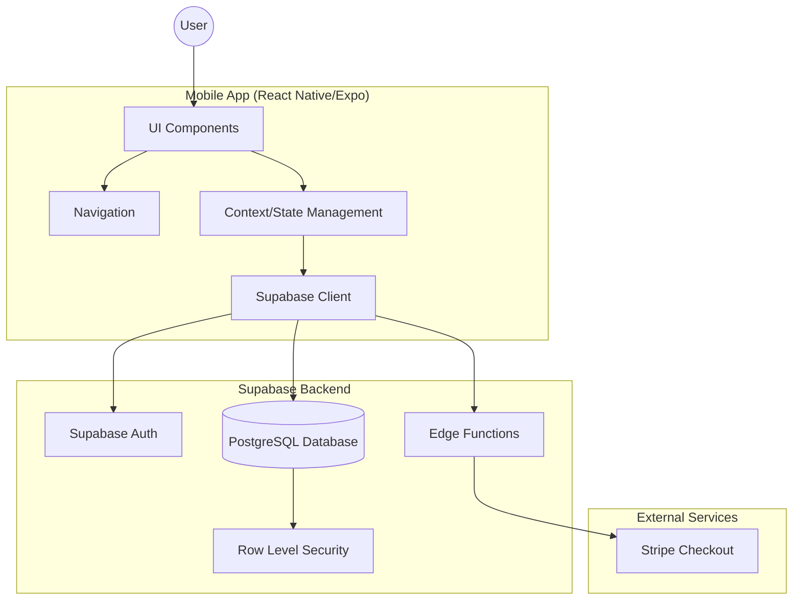
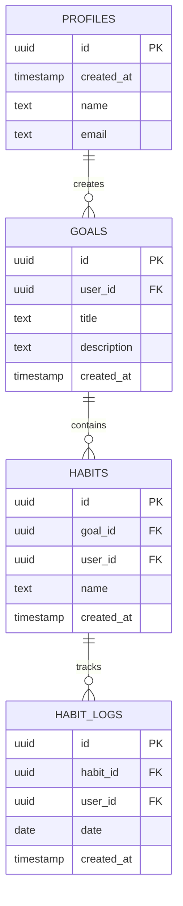
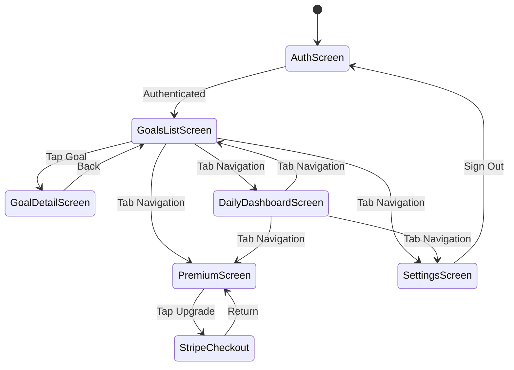
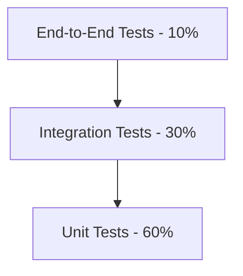

# Design Document

## Overview

Motiv MVP v0.1 is a mobile-first goal and habit tracking application built with React Native/Expo for cross-platform deployment, Supabase for backend infrastructure (authentication, database, and serverless functions), and Stripe for payment processing. The architecture prioritizes rapid development, minimal complexity, and clear separation between frontend UI, backend data operations, and third-party integrations.

### Technology Stack
- **Frontend**: React Native with Expo (managed workflow)
- **State Management**: React Context API with hooks
- **Backend**: Supabase (PostgreSQL + Auth + Edge Functions)
- **Authentication**: Supabase Auth (Email Magic Link)
- **Payments**: Stripe Checkout Sessions
- **Language**: TypeScript for type safety
- **Navigation**: React Navigation v6
- **Styling**: React Native StyleSheet with theme system

### Design Principles
1. **Minimal Viable Complexity**: Choose simplest solution that meets requirements
2. **Type Safety**: Leverage TypeScript throughout
3. **Offline-First Considerations**: Basic local state before sync (future enhancement)
4. **Clear Boundaries**: Separate UI, business logic, and data layers
5. **Security by Default**: RLS policies enforce multi-tenancy

## Architecture

### System Architecture



### Application Layers

**1. Presentation Layer (UI Components)**
- Screen components for each view
- Reusable UI components (buttons, cards, inputs)
- Navigation configuration
- Theme and styling

**2. Application Layer (State & Business Logic)**
- React Context providers for global state
- Custom hooks for business logic
- Form validation logic
- Streak calculation algorithms

**3. Data Layer (Supabase Integration)**
- Supabase client configuration
- Type-safe database queries
- Authentication flows
- Real-time subscriptions (optional for MVP)

**4. Integration Layer**
- Stripe Checkout Session creation via Edge Function
- Error handling and retry logic

## Components and Interfaces

### Database Schema



### Database Tables

**1. profiles**
```sql
CREATE TABLE profiles (
  id UUID PRIMARY KEY REFERENCES auth.users(id) ON DELETE CASCADE,
  created_at TIMESTAMP WITH TIME ZONE DEFAULT NOW(),
  name TEXT,
  email TEXT
);
```

**2. goals**
```sql
CREATE TABLE goals (
  id UUID PRIMARY KEY DEFAULT uuid_generate_v4(),
  user_id UUID NOT NULL REFERENCES profiles(id) ON DELETE CASCADE,
  title TEXT NOT NULL,
  description TEXT,
  created_at TIMESTAMP WITH TIME ZONE DEFAULT NOW()
);
```

**3. habits**
```sql
CREATE TABLE habits (
  id UUID PRIMARY KEY DEFAULT uuid_generate_v4(),
  goal_id UUID NOT NULL REFERENCES goals(id) ON DELETE CASCADE,
  user_id UUID NOT NULL REFERENCES profiles(id) ON DELETE CASCADE,
  name TEXT NOT NULL,
  created_at TIMESTAMP WITH TIME ZONE DEFAULT NOW()
);
```

**4. habit_logs**
```sql
CREATE TABLE habit_logs (
  id UUID PRIMARY KEY DEFAULT uuid_generate_v4(),
  habit_id UUID NOT NULL REFERENCES habits(id) ON DELETE CASCADE,
  user_id UUID NOT NULL REFERENCES profiles(id) ON DELETE CASCADE,
  date DATE NOT NULL,
  created_at TIMESTAMP WITH TIME ZONE DEFAULT NOW(),
  UNIQUE(habit_id, date)
);
```

### Row Level Security (RLS) Policies

**profiles table:**
```sql
-- Users can view their own profile
CREATE POLICY "Users can view own profile" ON profiles
  FOR SELECT USING (auth.uid() = id);

-- Users can update their own profile
CREATE POLICY "Users can update own profile" ON profiles
  FOR UPDATE USING (auth.uid() = id);
```

**goals table:**
```sql
-- Users can view their own goals
CREATE POLICY "Users can view own goals" ON goals
  FOR SELECT USING (auth.uid() = user_id);

-- Users can create goals
CREATE POLICY "Users can create goals" ON goals
  FOR INSERT WITH CHECK (auth.uid() = user_id);

-- Users can update their own goals
CREATE POLICY "Users can update own goals" ON goals
  FOR UPDATE USING (auth.uid() = user_id);

-- Users can delete their own goals
CREATE POLICY "Users can delete own goals" ON goals
  FOR DELETE USING (auth.uid() = user_id);
```

**habits table:**
```sql
-- Users can view their own habits
CREATE POLICY "Users can view own habits" ON habits
  FOR SELECT USING (auth.uid() = user_id);

-- Users can create habits
CREATE POLICY "Users can create habits" ON habits
  FOR INSERT WITH CHECK (auth.uid() = user_id);

-- Users can update their own habits
CREATE POLICY "Users can update own habits" ON habits
  FOR UPDATE USING (auth.uid() = user_id);

-- Users can delete their own habits
CREATE POLICY "Users can delete own habits" ON habits
  FOR DELETE USING (auth.uid() = user_id);
```

**habit_logs table:**
```sql
-- Users can view their own habit logs
CREATE POLICY "Users can view own habit logs" ON habit_logs
  FOR SELECT USING (auth.uid() = user_id);

-- Users can create habit logs
CREATE POLICY "Users can create habit logs" ON habit_logs
  FOR INSERT WITH CHECK (auth.uid() = user_id);

-- Users can delete their own habit logs
CREATE POLICY "Users can delete own habit logs" ON habit_logs
  FOR DELETE USING (auth.uid() = user_id);
```

### Frontend Application Structure

```
motiv-app/
├── src/
│   ├── components/           # Reusable UI components
│   │   ├── Button.tsx
│   │   ├── Input.tsx
│   │   ├── HabitCard.tsx
│   │   ├── GoalCard.tsx
│   │   └── StreakBadge.tsx
│   ├── screens/              # Screen components
│   │   ├── AuthScreen.tsx
│   │   ├── GoalsListScreen.tsx
│   │   ├── GoalDetailScreen.tsx
│   │   ├── DailyDashboardScreen.tsx
│   │   ├── PremiumScreen.tsx
│   │   └── SettingsScreen.tsx
│   ├── navigation/           # Navigation configuration
│   │   └── AppNavigator.tsx
│   ├── contexts/             # React Context providers
│   │   ├── AuthContext.tsx
│   │   ├── GoalsContext.tsx
│   │   └── HabitsContext.tsx
│   ├── hooks/                # Custom hooks
│   │   ├── useAuth.ts
│   │   ├── useGoals.ts
│   │   ├── useHabits.ts
│   │   └── useStreak.ts
│   ├── services/             # External service integrations
│   │   ├── supabase.ts
│   │   └── stripe.ts
│   ├── types/                # TypeScript types
│   │   └── index.ts
│   ├── utils/                # Utility functions
│   │   ├── streakCalculator.ts
│   │   └── dateHelpers.ts
│   └── theme/                # Styling and theme
│       └── index.ts
├── App.tsx                   # App entry point
├── app.json                  # Expo configuration
├── package.json
└── tsconfig.json
```

### Key TypeScript Interfaces

```typescript
// types/index.ts

export interface Profile {
  id: string;
  created_at: string;
  name?: string;
  email?: string;
}

export interface Goal {
  id: string;
  user_id: string;
  title: string;
  description?: string;
  created_at: string;
}

export interface Habit {
  id: string;
  goal_id: string;
  user_id: string;
  name: string;
  created_at: string;
}

export interface HabitLog {
  id: string;
  habit_id: string;
  user_id: string;
  date: string;
  created_at: string;
}

export interface HabitWithStreak extends Habit {
  streak: number;
  isCompletedToday: boolean;
}

export interface GoalWithHabits extends Goal {
  habits: HabitWithStreak[];
}
```

### Supabase Edge Function (Stripe Checkout)

**Function: create-checkout-session**

```typescript
import { serve } from 'https://deno.land/std@0.168.0/http/server.ts'
import Stripe from 'https://esm.sh/stripe@11.1.0?target=deno'

const stripe = new Stripe(Deno.env.get('STRIPE_SECRET_KEY') || '', {
  apiVersion: '2022-11-15',
})

serve(async (req) => {
  try {
    const { priceId } = await req.json()

    const session = await stripe.checkout.sessions.create({
      mode: 'subscription',
      payment_method_types: ['card'],
      line_items: [
        {
          price: priceId,
          quantity: 1,
        },
      ],
      success_url: 'motivapp://payment-success',
      cancel_url: 'motivapp://payment-cancel',
    })

    return new Response(
      JSON.stringify({ url: session.url }),
      { headers: { 'Content-Type': 'application/json' } }
    )
  } catch (error) {
    return new Response(
      JSON.stringify({ error: error.message }),
      { status: 400, headers: { 'Content-Type': 'application/json' } }
    )
  }
})
```

## Data Models

### Streak Calculation Algorithm

The streak calculation is a critical business logic component:

```typescript
// utils/streakCalculator.ts

export function calculateStreak(habitLogs: HabitLog[]): number {
  if (habitLogs.length === 0) return 0;

  // Sort logs by date descending
  const sortedLogs = habitLogs
    .map(log => new Date(log.date))
    .sort((a, b) => b.getTime() - a.getTime());

  const today = new Date();
  today.setHours(0, 0, 0, 0);

  const mostRecentLog = sortedLogs[0];
  mostRecentLog.setHours(0, 0, 0, 0);

  // Check if streak is broken (more than 1 day gap from today)
  const daysSinceLastLog = Math.floor(
    (today.getTime() - mostRecentLog.getTime()) / (1000 * 60 * 60 * 24)
  );

  if (daysSinceLastLog > 1) return 0;

  // Count consecutive days
  let streak = 0;
  let expectedDate = new Date(today);

  for (const logDate of sortedLogs) {
    logDate.setHours(0, 0, 0, 0);
    expectedDate.setHours(0, 0, 0, 0);

    if (logDate.getTime() === expectedDate.getTime()) {
      streak++;
      expectedDate.setDate(expectedDate.getDate() - 1);
    } else {
      break;
    }
  }

  return streak;
}
```

### Navigation Flow



## Error Handling

### Error Categories and Handling Strategies

**1. Authentication Errors**
- **Network failures**: Display retry button with error message
- **Invalid credentials**: Show user-friendly error message
- **Session expiration**: Redirect to auth screen with "Session expired" message

**2. Database Operation Errors**
- **Network failures**: Queue operation for retry, show offline indicator
- **Permission errors**: Log error, show "Access denied" message
- **Validation errors**: Display inline validation messages

**3. Stripe Integration Errors**
- **Session creation failure**: Display error alert with retry option
- **Network timeout**: Show "Payment service unavailable" message
- **Invalid configuration**: Log error, disable upgrade button

**4. Data Sync Errors**
- **Conflict resolution**: Last write wins (Supabase default)
- **Partial sync failures**: Retry failed operations, log errors

### Error Response Format

```typescript
interface AppError {
  code: string;
  message: string;
  userMessage: string;
  retry?: () => void;
}
```

### Global Error Handler

```typescript
// utils/errorHandler.ts

export function handleError(error: unknown): AppError {
  if (error instanceof SupabaseError) {
    return {
      code: error.code,
      message: error.message,
      userMessage: 'Something went wrong. Please try again.',
      retry: error.retry,
    };
  }

  if (error instanceof NetworkError) {
    return {
      code: 'NETWORK_ERROR',
      message: error.message,
      userMessage: 'No internet connection. Please check your network.',
      retry: error.retry,
    };
  }

  return {
    code: 'UNKNOWN_ERROR',
    message: String(error),
    userMessage: 'An unexpected error occurred.',
  };
}
```

## Testing Strategy

### Testing Pyramid



### Unit Testing

**Coverage Focus:**
- Utility functions (streak calculator, date helpers)
- Custom hooks (useStreak, useHabits)
- State management logic
- Form validation

**Tools:**
- Jest for test runner
- React Native Testing Library for component testing
- Mock Supabase client for isolation

**Example Test:**
```typescript
// utils/__tests__/streakCalculator.test.ts

describe('calculateStreak', () => {
  it('returns 0 for empty logs', () => {
    expect(calculateStreak([])).toBe(0);
  });

  it('calculates consecutive days correctly', () => {
    const logs = [
      { date: '2025-01-05' },
      { date: '2025-01-04' },
      { date: '2025-01-03' },
    ];
    expect(calculateStreak(logs)).toBe(3);
  });

  it('resets streak on gap', () => {
    const logs = [
      { date: '2025-01-05' },
      { date: '2025-01-03' }, // gap
      { date: '2025-01-02' },
    ];
    expect(calculateStreak(logs)).toBe(1);
  });
});
```

### Integration Testing

**Coverage Focus:**
- Supabase CRUD operations
- Authentication flows
- RLS policy enforcement
- Edge Function calls

**Tools:**
- Supabase local development environment
- Test database with seed data

**Test Scenarios:**
- Create goal → verify in database
- Create habit → verify RLS allows access only to owner
- Check in habit → verify log created and streak updates
- Call Stripe Edge Function → verify session URL returned

### End-to-End Testing

**Coverage Focus:**
- Critical user paths
- Complete workflows

**Tools:**
- Detox for React Native E2E testing
- TestFlight for manual QA

**Test Scenarios:**
1. **New User Onboarding**: Sign up → Create goal → Create habit → Check in → Verify streak
2. **Daily Check-in Flow**: Open app → View today's habits → Check in → Verify completion
3. **Premium Upgrade**: Navigate to premium → Tap upgrade → Verify Stripe Checkout opens

### Manual QA Checklist

- [ ] Sign up with email magic link
- [ ] Create 3 goals with descriptions
- [ ] Add 2-3 habits per goal
- [ ] Check in habits for 3 consecutive days
- [ ] Verify streak increments correctly
- [ ] Test habit unchecking (toggle)
- [ ] Navigate between all screens
- [ ] Test sign out and sign back in
- [ ] Verify data persists across sessions
- [ ] Test Stripe Checkout flow
- [ ] Test on iOS and Android devices
- [ ] Test with poor network connectivity
- [ ] Test with airplane mode (error handling)

## Performance Considerations

### Optimization Strategies (MVP Scope)

**1. Database Queries**
- Use Supabase query filters to fetch only necessary data
- Limit habit_logs queries to last 90 days for streak calculation
- Index on `user_id` and `date` columns

**2. State Management**
- Avoid unnecessary re-renders with React.memo
- Use useMemo for expensive calculations (streak computation)
- Lazy load screens with React Navigation

**3. Asset Optimization**
- Use appropriate image sizes
- Lazy load images if needed (future)

**Performance Metrics (Not Tracked in MVP)**
- App launch time: < 3 seconds
- Screen transition: < 300ms
- Database query response: < 500ms

## Security Considerations

### Authentication Security
- **Email Magic Link**: No password storage, secure token-based auth
- **Session Management**: Supabase handles secure token storage
- **Timeout**: Default Supabase session timeout (configurable)

### Data Security
- **RLS Policies**: Enforce at database level, not app level
- **User Isolation**: All queries filtered by `auth.uid()`
- **SQL Injection**: Parameterized queries via Supabase client

### API Security
- **Edge Functions**: Require authentication header
- **Stripe Keys**: Store secret keys in Supabase environment variables
- **CORS**: Configure Supabase to allow only app origins

### Client-Side Security
- **No Sensitive Data in AsyncStorage**: Only store session tokens (handled by Supabase)
- **HTTPS Only**: All API calls over HTTPS
- **Code Obfuscation**: Expo build process handles basic obfuscation

## Deployment Strategy

### Development Environment
- **Local Development**: Expo Go app for rapid iteration
- **Local Supabase**: Optional local Supabase instance for offline dev
- **Environment Variables**: `.env` file for API keys (not committed)

### Staging Environment
- **Supabase Project**: Separate staging project
- **Stripe Test Mode**: Use Stripe test keys
- **TestFlight/Internal Testing**: Deploy to internal testers

### Production Environment
- **Expo EAS Build**: Build production iOS and Android binaries
- **Supabase Production**: Production Supabase project
- **Stripe Live Mode**: Live Stripe keys
- **App Store Deployment**: Submit to Apple App Store and Google Play Store

### Environment Configuration

```typescript
// .env.example
SUPABASE_URL=https://xxx.supabase.co
SUPABASE_ANON_KEY=xxx
STRIPE_PUBLISHABLE_KEY=pk_test_xxx

// .env.production
SUPABASE_URL=https://xxx.supabase.co
SUPABASE_ANON_KEY=xxx
STRIPE_PUBLISHABLE_KEY=pk_live_xxx
```

## Open Questions and Future Considerations

### MVP Scope Decisions
- ✅ React Native/Expo chosen for cross-platform speed
- ✅ Email magic link for authentication (no OAuth in MVP)
- ✅ No offline mode (Supabase handles basic caching)
- ✅ No push notifications in MVP
- ✅ Simple tab navigation (no complex gestures)

### Post-MVP Enhancements (Out of Scope)
- Weekly habit frequency options
- Custom habit schedules
- Habit reminders/notifications
- Analytics and progress charts
- Premium feature gating
- Social features
- Habit templates
- Dark mode
- Accessibility improvements
- Localization

### Technical Debt Accepted for MVP
- No comprehensive error recovery mechanisms
- Minimal offline support
- No data migration strategy
- No A/B testing framework
- Basic styling (no design system)
- Limited test coverage (focus on critical paths)

These trade-offs prioritize speed to market and learning over long-term maintainability, appropriate for an MVP validation phase.
